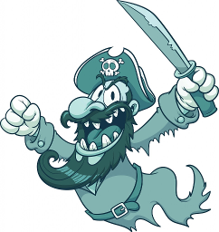

# Notes

## Backbone with RestHub framework

Exemple d'utilisation de backbone avec Resthub.

Lancement automatique :

	mvn clean package jetty:run
	
Accès url de test :

	http://localhost:8080/
	
Façade rest exemple :

	http://localhost:8080/api/sample
	

## Génération de la documentation Skin Bootstrap

Génération de la documentation en markdown via le plugin Doxia maven.

	mvn site
	
Accès à la documentation :

	${project.build.directory}/target/site/index.html
	

	

